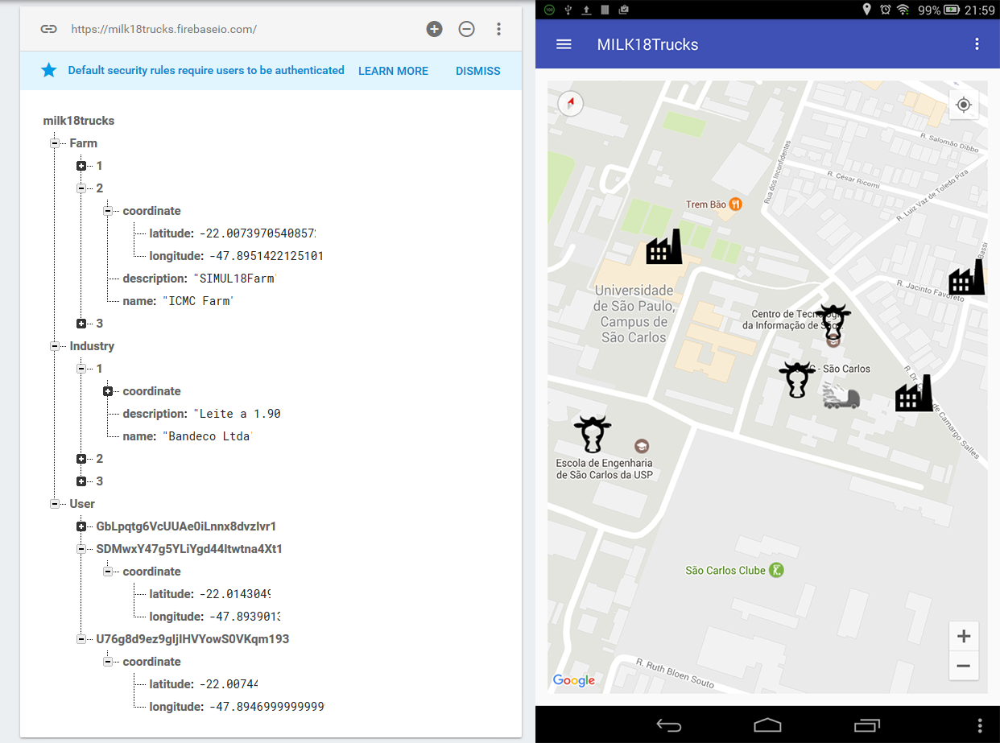

# MILK18Trucks

MILK18Trucks is a project to study computer network in the course of Advanced Topics in Communication.

The project was also submitted in the [Ideas for Milk][ideas] challenge in 2016, competing solutions to improve brazilian milk industry.

The main objective is track and optimize the collect of milk. To achieve this, MILK18Trucks is based on the following features:

* Optimize route and collects for the truck driver that transport the milk
* Assist records of collect sample, which is required to decide if accept or not the milk in the current state
* Improve transport control of milk from farm to industry
* Provide prediction of collect arrival to the farmer

MILK18Trucks has the differential of low cost and logistic with mobile application, which currently supply the needs for the industries in Brazil.

## Prototype

Using Android Studio and Firebase, our team developed a prototype with some functionalities.

The app uses the Google Maps API to show a map and markers with locations of (fictional) farms, industries and (real) users. These informations are gathered from a Firebase server.

The app also keeps uploading the user's current position to the server.

Authentication is required to differ a user from another, which is also handled by Firebase.

An admin can see the location in real time of all truck drivers and the users can see where is the farms and industries available to him.

The following image show the Firebase database and MILK18Trucks app:

In [Releases](https://github.com/luanorlandi/MILK18Trucks/releases) tab there is a builded apk of MILK 18 Trucks app for Android (this is not submitted in Play Store, so it will require developer mode enabled to install it).

## Credits

Project members:

* Alyson M. Nascimento
* Henrique Pasquini Santos
* Leonardo Mellin Moreira Ferreira
* Luan Gustavo Orlandi
* Raul Zaninetti Rosa

Guided by Edson Moreira, João D. Batista and Ivo Sócrates.

## License

[MIT](LICENSE)

[ideas]: <http://www.ideasformilk.com.br/>